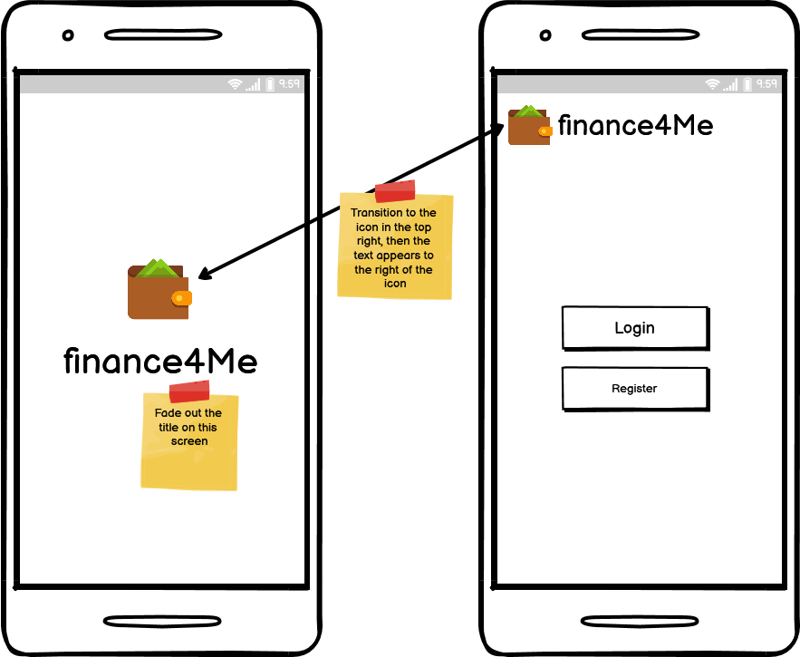
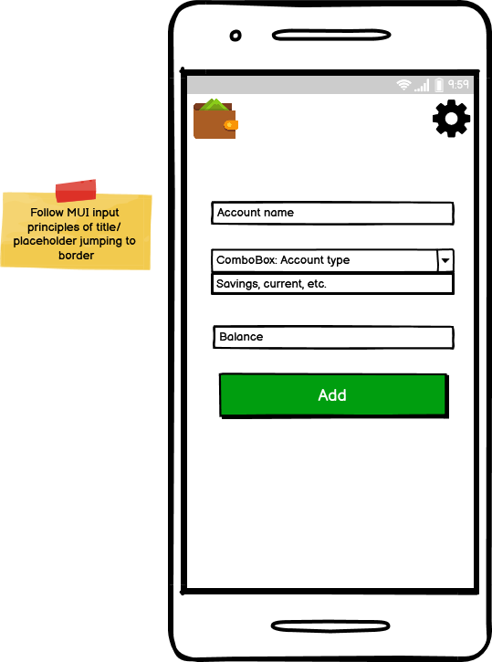
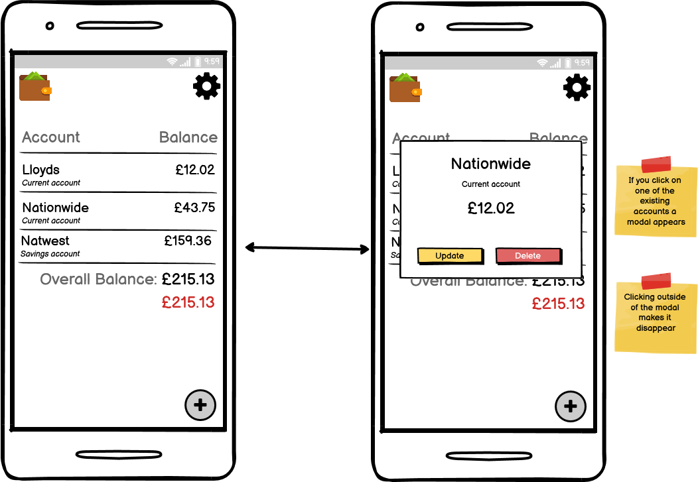
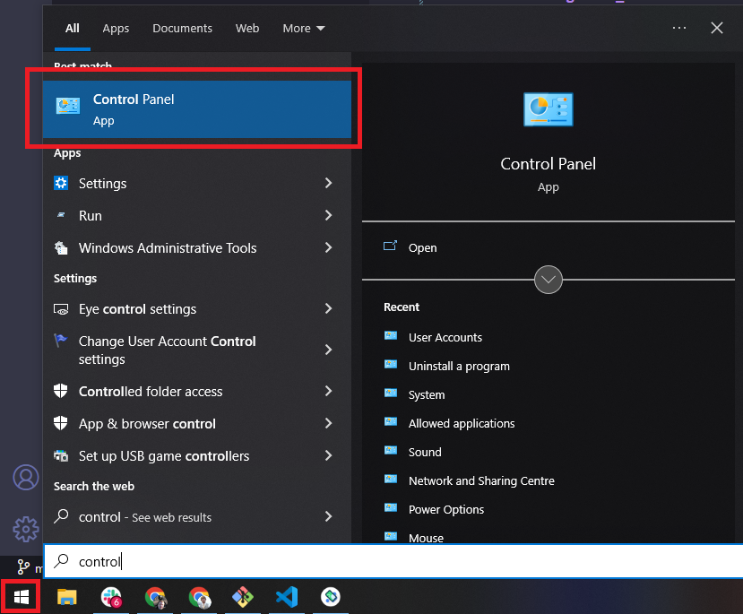
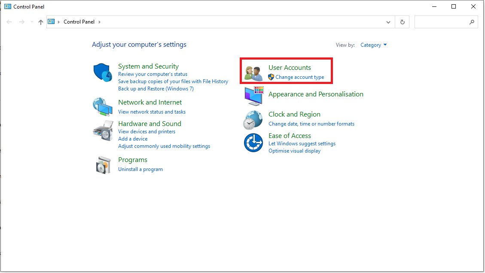
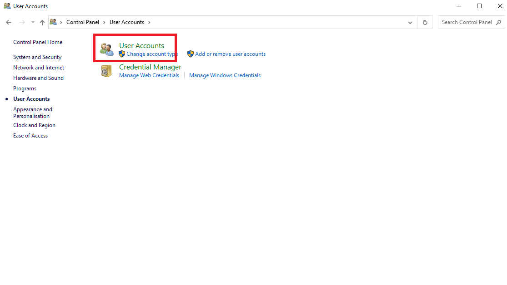
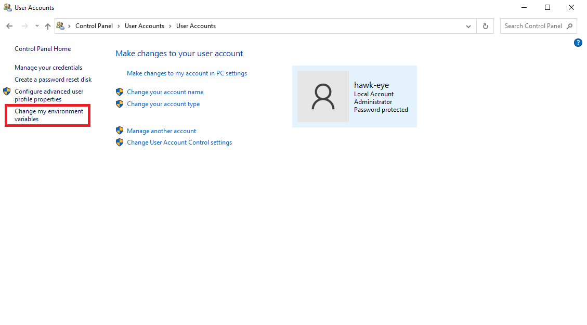
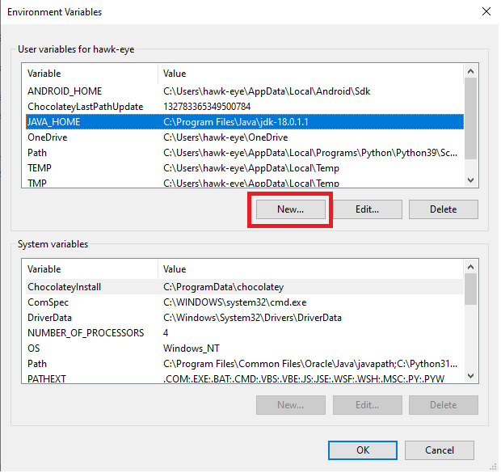

# Project Goals

## Requirements

1. Node.js
    1.1. `NPX`
2. Android Studio
3. Java Runtime Environment
    3.1. Setting `JAVA_HOME`

The below is specific for Windows 10. If any links are broken use them to influence what items to download (e.g. pick a newer version).

## App designs

The designs below give an indication of the pages the user will be able to interact with in the "finance4Me" application.

1. Splash Screen & Login / Registration Screen



2. Introduction Screen


3. Dashboard Screen


4. Add Account Screen



5. Edit & Delete Account Modal



## Development setup

### 1. Node.js

You will need node.js to manage all packages for your react native application. You can get the latest stable version from the link here https://nodejs.org/en/

### 2. Android Studio

Building application using react native is handy as it means you write the code once and apply it to android and apple devices. You still will need though the specific environments for testing your code. For android this is best done through an emulator that comes with Android Studio. You can download the application from this link https://developer.android.com/studio/

### 3. Java Runtime Environment

You will need to download [Java](https://www.oracle.com/java/technologies/downloads/#jdk18-windows) in order to build Android application on Windows 10.

### 3.1. Setting JAVA_HOME

You will need to setup `JAVA_HOME` in your environment variables to be able to access the Java runtime.

1. Search for the control panel in windows.



2. Click on "User Accounts"



3. Click on "User Accounts" again



4. Click on "Change my environment variables



5. Click on "New" and create an entry similar to the one show highlighted in blue



## Local Development

### 1. Launch Android Studio

Launch Android Studio and in the top right hand corner select the AVD Manager (use these docs if you get stuck https://reactnative.dev/docs/environment-setup).

Pick the virtual device you setup and launch it. 

### 2. Navigate to the project root

Once in the project root you can run `npx react-native start`. This should be left open in a CMD window. This will start the Metro Bundler.
Check that you emulator is a reachable device with `adb devices`. Then start the application with `npx react-native run-android`. This will launch into a build of the application.

If there are any errors you will need to address them accordingly, commonly this relates to: 
1. __JAVA_HOME__ missing - see above on setting up JAVA_HOME,
2. "could not find react/package.json" / Unrecognized command "run-android" - run `npm install` to get the missing dependencies,

## Building an APK

### 1. Build for Android

```shell
react-native bundle --platform android --dev false --entry-file index.js --bundle-output android/app/src/main/assets/index.android.bundle --assets-dest android/app/src/main/res
```

If you run into an error try the following:

1. Navigate to `android/app/src/main/assets`. If the asset folder does not exist then create it.
2. If the asset folder exists then delete __index.android.bundle__ and __index.android.bundle.meta__ if they exist.
3. Navigate to the android folder mad run `./gradlew clean`
4. Run the shell command again


### 2. Build APK

Navigate into `./android` and then run `gradlew assembleDebug`

